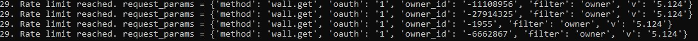

# antoninas_rap

## _*Различия в развитии рэп-культуры (культуры хип-хопа) в Санкт-Петербурге и в Москве в период пандемии.*_

### Для анализа были выбранны 4 сообщества ВКонтакте. 2 сообщества, посвященных рэпу в Москве и 2 в Санкт-Петербурге. Выбор был сделан, основываясь на популярности сообществ, которая определялась числом подписчиков.
[VK1](https://vk.com/rapda)
[VK2](https://vk.com/beatonn)
[VK3](https://vk.com/rap4all)
[VK4](https://vk.com/club6662867)

### В ходе исследования были проанализированы темпы развития групп за последний год (с 01.10.2019). Данный период был выбран для анализа из-за феномена пандемии и изменения в использовании социальных сетей мировым сообществом на карантине. 

#### Не смотря на то, что анализ такого большого количества подписчиков, как был запланирован изначально не был осуществлен из-за слишком больших объемов... 

#### Мне, все же, удалось прийти к некоторым выводам:
* *количество просмотров и посещений страниц, выбранных для анализа выросло во время первой волны карантина и так и не опустилось до исходных значений, даже после снятия ограничений, как в Москве, так и в Санкт-Петербурге* 
* *не смотря на разнообразную географию пользователей, подписанных на все 4 сообщества между ними наблюдается устойчивая взаимосвязь*

* *Если говорить о статистике постов сообществ:*
    - *просмотры постов в сообществах Москвы имели более сильный подъем чем сообщества Петербурга*
    - *увеличения репостов различаются в меньшей степени*
    
 ## _*My jupiter notebook is [here](antoninasrap.ipynb)*_ 
